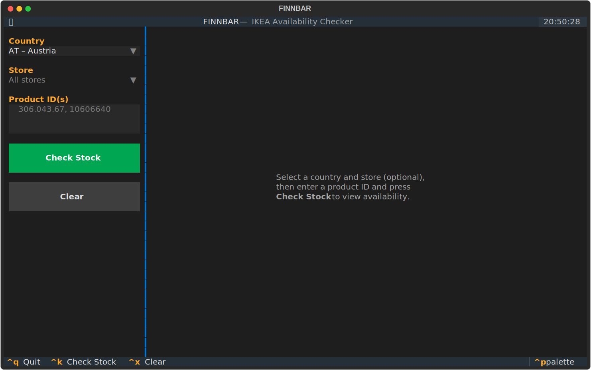

# FINNBAR

**FINNBAR** - a TUI for browsing and checking real-time IKEA product availability across your local stores, without
leaving the terminal.

---

No more clicking through IKEA's website only to find your KALLAX is out of stock. **FINNBAR** (_finns bara_ — Swedish
for "is available") lets you search, filter, and check availability across multiple stores — all from the comfort of
your terminal.

## Features

- 🏪 **Browse stores** – list all IKEA stores for any supported country (40+ countries, 400+ stores)
- 📦 **Check stock** – look up real-time availability for one or more product IDs across all stores in a country
- ⌨️ **Keyboard-driven** – full keyboard navigation with shortcut bindings

## Requirements

- Python 3.11+

## Installation

```bash
# Download the latest release from PyPI
pipx install finnbar

# Launch the TUI
finnbar
```

## Screenshots



## Usage

| Keyboard shortcut | Action                                    |
|-------------------|-------------------------------------------|
| `Ctrl+K`          | Check stock for the entered product ID(s) |
| `Ctrl+X`          | Clear results                             |
| `Ctrl+Q`          | Quit                                      |

### Checking stock

1. Select a **country** from the dropdown
2. Optionally select a **store** from the dropdown (or leave it as "All stores")
3. Enter one or more **product IDs** in the input field (comma-separated, e.g. `306.043.67, 10606640`)
4. Press **Check Stock** or `Ctrl+K`

Built with [Textual](https://github.com/Textualize/textual) and powered by
the [ikea-availability-checker](https://github.com/Ephigenia/ikea-availability-checker) data.
